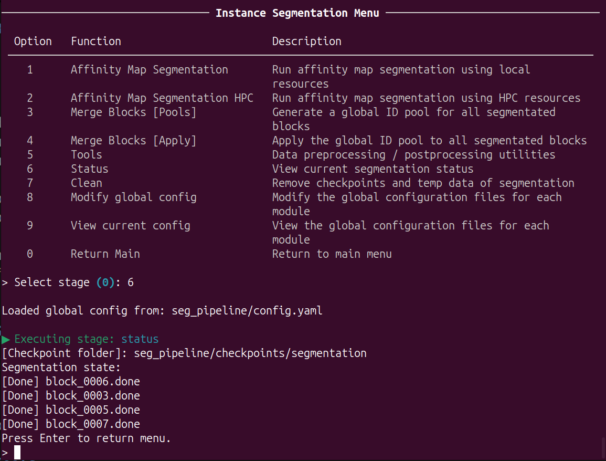

# Instance Segmentation
This tutorial provides step-by-step guidance for instance segmentation pipeline.
> This section is integration and encapsulation of pytc. For more detailed, please refer to [pytc document](https://connectomics.readthedocs.io/en/latest/tutorials/neuron.html).

#### Main Menu

Run ```python -m K_NeuronSeg``` to start the CLI.


The main interface consists of two functional modules: affinity map inference module and instance segmentation module.

Input ```2``` and ```Enter```, enter the **instance segmentation module**:


 
#### Options

This module can be used for configuration, affinity map segmentation by blocks, blocks merging and management.

- In affinity map segmentation: perform superpixelization and aggregation on precomputed affinity maps in block-wise fashion to generate instance segmentation results for neurons.

- In blocks merging: due to segmentation instability and field-of-view limitations, this module performs the most optimal merging of instance segmentation results for each neural network block.

##### Global Configuration
This section is identical to the previous configuration. Only an interface has been added to facilitate configuration.
Input ```9``` and ```Enter```, view current **global configuration**:
Input ```8``` and ```Enter```, edit current **global configuration**:


For the title:
- ```Section```: the configuration file for which module.
- ```Parameter```: the key in configuration file.
- ```Value```: the value of key

For the keys in instance segmentation module:
- ```main```: the main config file path for affinity map segmentation module, incuding segmentation and aggregation. 
- ```prec```: the config file path for the Precomputed format converter.
- ```downsample```: the config file path for the Precomputed data downsampling.
- ```gen_mask```: the config file path for mask generator of Precomputed data.
- ```mask_prec```:  the config file path for masking of Precomputed data.
- ```mask_tif```: the config file path for masking of tif data.
- ```resize_tif```: the config file path for resizing of tif data.

> ***The meaning of each parameter is documented in every configuration file.***


##### Affinity map segmentation by blocks

Input ```1``` and ```Enter```, using ***local resources*** to perform affinity map segmentation by blocks.

Input ```2``` and ```Enter```, using ***HPC resources*** to perform affinity map segmentation by blocks. 

The module is based on the configuration files (```main``` ,  in global configuration file)

Before start the training, you can modify the configuration:


This step perform superpixelization and aggregation on precomputed affinity maps in block-wise fashion to generate instance segmentation results for neurons

##### Blocks merging: pools

Input ```3``` and ```Enter```, using ***local resources*** to generate a global ID pool for all blocks.

The module is based on the configuration files (```main``` ,  in global configuration file). And before start the training, you can modify the configuration.

This step perform counting and calculating the global ID based on the intersection areas between blocks, and outputs a global ID pool.

The process is fast and uses minimal memory. You can directly use local resources or manually allocate HPC resources.


##### Blocks merging: apply 

Input ```4``` and ```Enter```, using ***local resources*** to apply the global ID pool to all blocks and output a precomputed data of full volume.

The module is based on the configuration files (```main``` ,  in global configuration file). And before start the training, you can also modify the configuration.

Based on the previously computed ID pool, this step applies it to all blocks and progressively writes it into the precomputed data.

You can directly use local resources or manually allocate HPC resources.


##### Status
Input ```6``` and ```Enter```, enter the **Status Info**. This section indicates which blocks have been successfully segmentated:


##### Clean
Input ```7``` and ```Enter```, enter the **Clean Function**. This section clear cache files and checkpoints of merging.


##### Tools
Input ```5``` and ```Enter```, enter the **tool menu**:


Input ```1``` and ```Enter```, using ***local resources*** to convert tif/h5 data to precomputed format. 

Input ```2``` and ```Enter```, using ***HPC resources*** to convert tif/h5 data to precomputed format. 

These tools are based on the configuration files (```prec``` in global configuration file).Before start the converting, you can modify the configuration by CLI or any tools.

Input ```3``` and ```Enter```, using ***local resources*** to create lower-resolution mipmap levels using voxel downsampling for precomputed data.

Input ```4``` and ```Enter```, using ***HPC resources*** to create lower-resolution mipmap levels using voxel downsampling for precomputed data.

These tools are based on the configuration files (```downsample``` in global configuration file).Before start the converting, you can modify the configuration by CLI or any tools.

Input ```5``` and ```Enter```, using ***local resources*** to generate binary masks from affinity maps.

Input ```6``` and ```Enter```, using ***HPC resources*** to generate binary masks from affinity maps.

These tools are based on the configuration files (```gen_mask``` in global configuration file).Before start the converting, you can modify the configuration by CLI or any tools.

Input ```7``` and ```Enter```, using ***local resources*** to apply a mask to prec images, preserving structure.

Input ```8``` and ```Enter```, using ***HPC resources*** to apply a mask to prec images, preserving structure.

These tools are based on the configuration files (```mask_prec``` in global configuration file).Before start the converting, you can modify the configuration by CLI or any tools.

Input ```9``` and ```Enter```, using ***local resources*** to apply a mask to tif images, preserving structure.

Input ```10``` and ```Enter```, using ***HPC resources*** to apply a mask to tif images, preserving structure.

These tools are based on the configuration files (```mask_tif``` in global configuration file).Before start the converting, you can modify the configuration by CLI or any tools.

Input ```11``` and ```Enter```, using ***local resources*** to resize tif volumes to new voxel size or dimension.

Input ```12``` and ```Enter```, using ***HPC resources*** to resize tif volumes to new voxel size or dimension.

These tools are based on the configuration files (```resize_tif``` in global configuration file).Before start the converting, you can modify the configuration by CLI or any tools.


